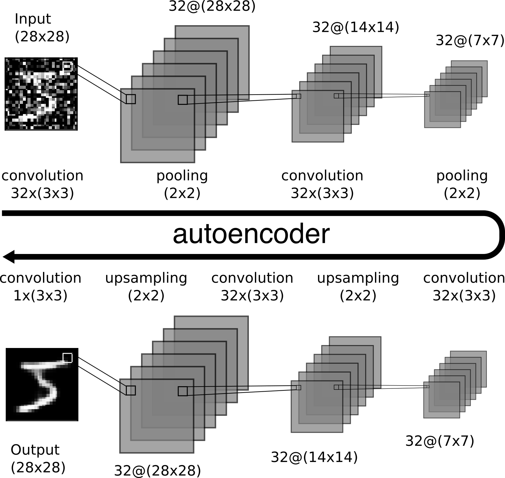
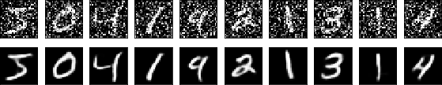

# My Deep learning (mdl)

This is a brief summary of my learnt topics in deep learning. Although this is not a tutorial you can still find some usefull codes in the correspodent topic folder.

# 3. ConvNet Autoencoders

Along my studies of convolutional neural networks (ConvNet) autoencoders, I reproduced the examples suggested on Keras blog (https://blog.keras.io/building-autoencoders-in-keras.html). The main idea behind autoencoders is first reduce the dimensionality (**Encoder**) and than later increase back (**Decoder**). 

One of the most interesting examples we used keras to construct an autoencoder capable to **denoise** the MNIST images. Bellow, the result after 100 epochs training on MNIST data using a ConvNet architecture described on the later figure.

I am currently using ConvNet autoencoders on experiments with Digital Holography Microscopy. Naturally, much complex architecture using batch normalization and other tricks.

# 2. APS
Here as part of the exercises proposed for the quantum machine learning reading group ([qml-rg](https://github.com/peterwittek/qml-rg.git)) we used the basic LeNet CNN architecture to identify the Einstein or Marie Curie images into a given set of images. Here we tried two ways of training the model: Standard and using **Augmentation** for the training dataset. Turns out that the use us augmentation improves enormously the accuracy of the model.  

| model     | Accuracy | Loss |
| --------- | :------: | :--: |
| Standard  |  88.89%  | 1.21 |
| Augmented |   100%   | 0.0  |

# 1. LeNet 

Here is my first example of Deep Learning algorithm using Keras. We used the **MNIST** dataset of handwriting numbers (60.000 images 28x28 px) to train a basic CNN. This example comes from [PyImageSearch site](http://www.pyimagesearch.com/2016/08/01/lenet-convolutional-neural-network-in-python/).

 
