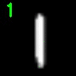

# My Deep learning (mdl)

My Deep Learning (mdl) is a repository where I'll keep all my learnt example regarding machine learning codes. They will be mostly examples found on web that run and adapt to better works into my brain. Also all examples found here should run in macos using the updated version of Anaconda and the required packages.

* For tidness reasons I'll try to mantain all examples organized in a structure that remainds this:

```javascript
    |--- output
    |--- core
    |   |--- __init__.py
    |   |--- classes.py
    |--- train.py
    |--- test.py
```

> Here the **\__init\__.py** defines the core folder as a module. Usually it imports the create classes like this:
> 
 ```javascript
 from classes import LeNet, ImageEdit, ImageNormalize
 ```

* Most of examples also contains a python notebook with some basic notes and comments about the code. 

Teste

---

# 2. APS
Here as part of the excersices proposed for the quantum machine learning reading group ([qml-rg](https://github.com/peterwittek/qml-rg.git)) we used the basic LeNet CNN architeture to identify the Einstein or Marie Curie images into a given set of images. Here we tried two ways of training the model: Standard and using **Augmentation** for the training dataset. Turns out that the use us augementation improves enormously the accuracy of the model.  

| model     | Accuracy | Loss  |
| --------- |:--------:|:-----:|
| Standard  | 88.89%   | 1.21  |
| Augmented |  100%    | 0.0   |


---

# 1. LeNet 

Here is my first example of Deep Learning algorithm using Keras. We used the **MNIST** dataset of handwriting numbers (60.000 images 28x28 px) to train a basic CNN. This example comes from [PyImageSearch site](http://www.pyimagesearch.com/2016/08/01/lenet-convolutional-neural-network-in-python/).

 

---
